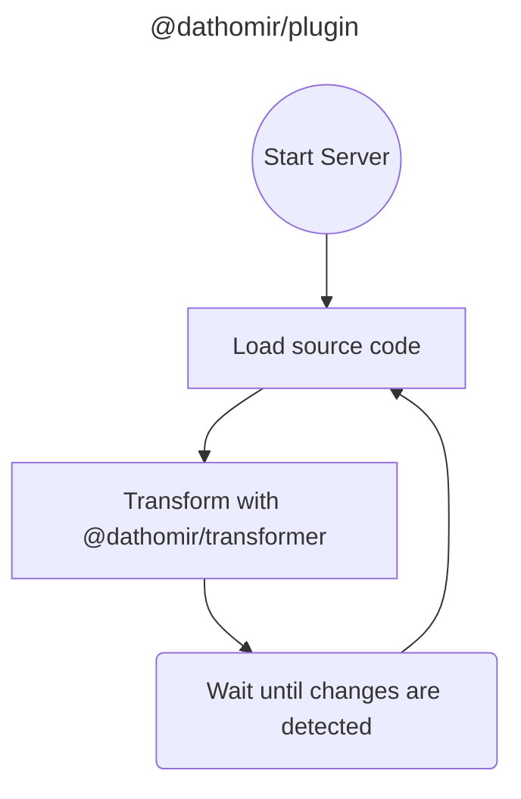
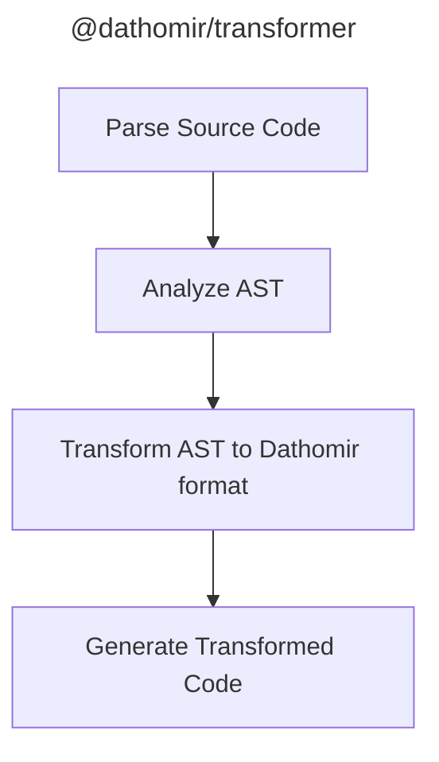
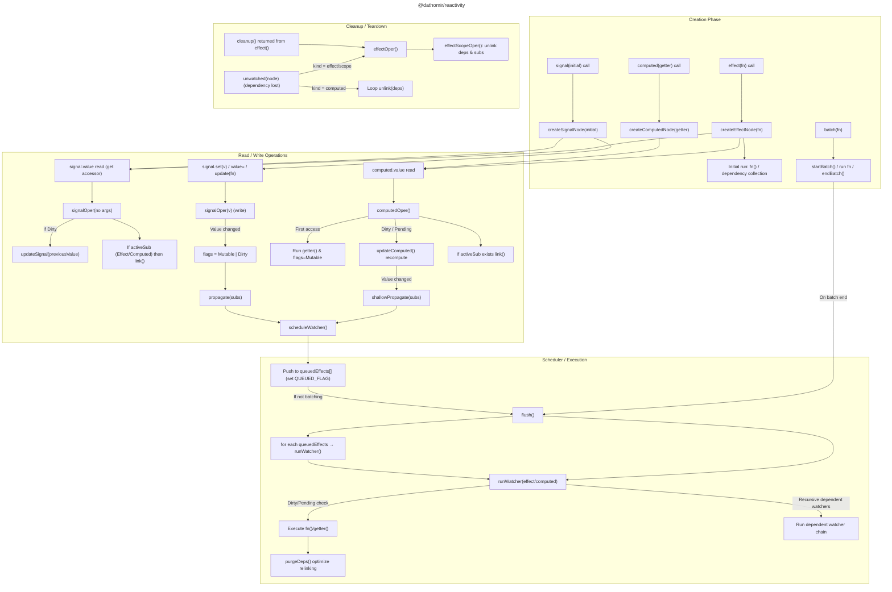
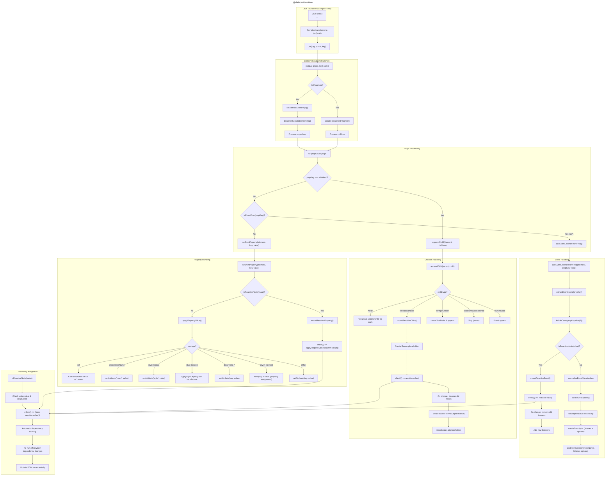

# dathomir Project Common Instructions

## Project Overview
This project develops a framework library that uses two primary technologies — web components and signals (tc39 signals, alien-signals) — to build modern and efficient web applications.

## Initial Instructions
Read and understand these instructions before you start working.
- You act as an expert front-end engineer. You have deep knowledge and experience in front-end development and are capable of designing, developing, and maintaining libraries.
- You are responsible for the design, development, and maintenance of this project. The human running the prompt provides instructions; you should collaborate with that person to achieve the project's goals.
- Read the Directory Structure Instructions to understand the project's directory layout.
- Read the Commands Instructions to understand the commands used in the project.
- When reasoning about the contents of individual packages, read the `<package-name>.instructions.md` file to understand the purpose and contents of that package.
- The project's goals are described in `project-todo.instructions.md`. Collaborate with the human to accomplish those goals.
- For TypeScript development, follow the development principles in `typescript-development-principles.instructions.md`. Prioritize type safety and code quality.
- Please provide responses in Japanese.

## Directory Structure Instructions
- `~/<project-root>/` : Project root
  - `./config/` : Configuration files for packages
  - `./packages/` : The dathomir project packages
    - `./packages/dathomir/` : The core dathomir framework package that aggregates other packages.
    - `./packages/plugin/` : Plugins for build tools (Vite, webpack, ...)
    - `./packages/reactivity/` : Packages implementing signals functionality
    - `./packages/runtime/` : Runtime-related packages
    - `./packages/transformer/` : Compiler/transformer-related packages
  - `./.github/` : GitHub related configuration files
  - `./dathomir.code-workspace` : VSCode workspace settings file
  - `./.tool-versions` : Tool version management file for development tools

## Commands Instructions
- Run commands from the project root.
- Use `pnpm` to install packages, build, test, and lint.
- Each package exposes shortcut commands — always use them when running package-specific scripts.
  - Shortcut command notation
    - `./packages/*` : `pnpm p:<package-name> <command>`
      e.g. to build `./packages/plugin/`, run `pnpm p:plugin build`.
    - `./config` : `pnpm cfg <command>`
      e.g. to add a library to `./config/`, run `pnpm cfg add <package-name>`.

## Priority Instructions
- `*.instructions.md` files may contain `priority: <number>` tags.
- A higher `priority` value indicates a more important instruction. If `priority` is not specified, it is considered `0`.
- The range of `priority` is from `-1` to `9999`.

### Priority Handling Rules
- If two instructions contain overlapping items, compare their `priority` values and follow only the one with the higher priority.
  - example
    ```
    # file A.instructions.md
    priority: 1
    - Do A
      - description of A-A
    - Do B
      - description of A-B

    # file B.instructions.md
    priority: 2
    - Do B
      - description of B-B
    - Do C
      - description of B-C
    ```
    In this example both instruction files mention `Do B`, but you should follow the `B.instructions.md` instruction because it has the higher `priority`, and thus follow `description of B-B`.
- If `priority` values are equal, follow both instructions.
- If `priority` is negative, ignore that instruction.
- If the highest `priority` among instructions is `0` or below, ignore all instructions.

### Project Logic Flow
#### @dathomir/plugin


#### @dathomir/transformer


#### @dathomir/reactivity


#### @dathomir/runtime


### TODOs Instructions
- The project's overall TODOs are recorded in `project-todo.instructions.md`.
- Each package's TODOs are also listed in `project-todo.instructions.md`.
- In general, `project-todo.instructions.md` is managed by humans and you are responsible for executing items when instructed.
- Do not execute items from `project-todo.instructions.md` without explicit human direction.
- Do not add items to `project-todo.instructions.md` on your own initiative.
- Only execute items from `project-todo.instructions.md` when a human explicitly asks you to do so.
- You will not execute all `project-todo.instructions.md` items at once; a human will specify which items to run.
- If a human does not specify which TODO to run, do nothing.
