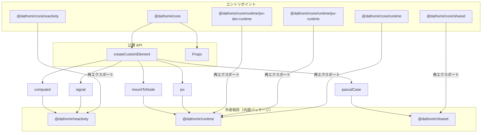
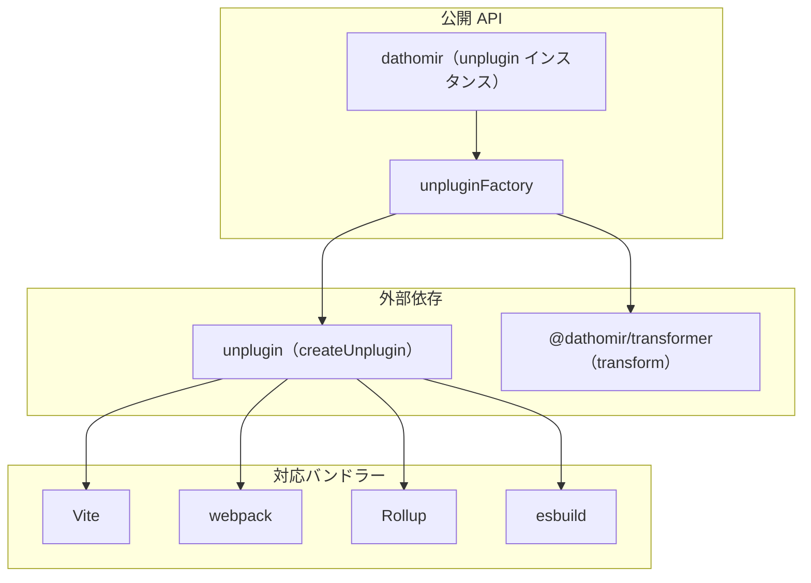
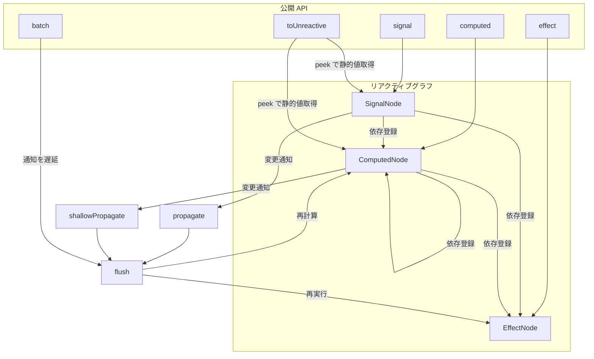
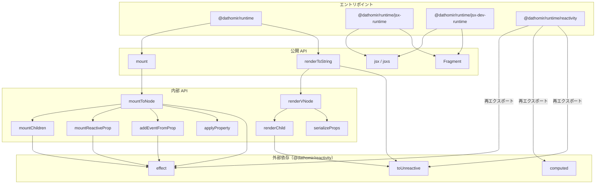
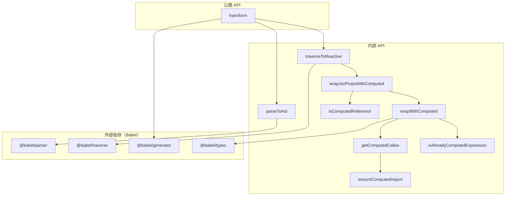
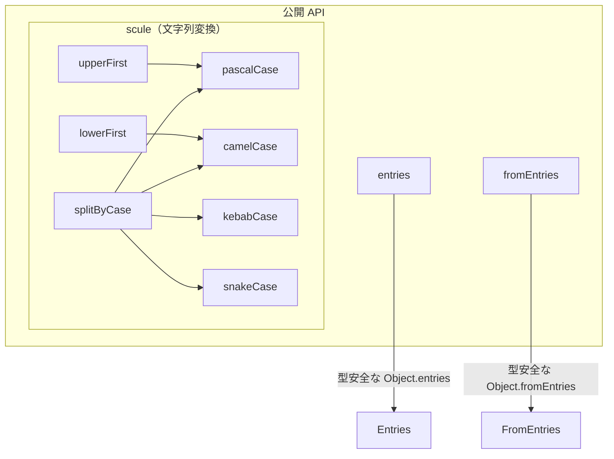

# AGENTS.md

## プロジェクト概要

このプロジェクトは、**Web Components** と **Signals**（tc39 signals、alien-signals）を主要技術として使用し、モダンで効率的な Web アプリケーションを構築するためのフレームワークライブラリを開発しています。

## 言語

**日本語**で応答してください。

## セッションガイドライン

### セッション開始時

1. この `AGENTS.md` と関連するパッケージ固有の instructions を読む
2. コードベースの現状を確認する（git status、最近のコミット）
3. 変更を加える前に、依頼されたタスクのスコープを理解する

### セッション終了時

1. すべての変更が**クリーンな状態**であることを確認する（半端な実装を残さない）
2. コードは main ブランチにマージ可能な状態にする：重大なバグなし、適切にドキュメント化
3. タスクを完了できない場合は、現状と残作業を文書化する

## AI エージェントへの重要な注意事項

### タスク実行ルール

- **人間の明示的な指示なしに TODO を実行しないこと**
- 人間がタスクを依頼する際、どの項目を作業するか具体的に指定する
- 自分の判断で TODO リストに項目を追加しないこと
- 人間がどのタスクを実行するか指定しない場合は、確認を求めること

### 変更を加える前に

- コードを修正する前に十分なコンテキストを収集する
- 依存パッケージの最新仕様を理解すること（Context7 等を活用）
- 大きな変更の場合は、先に人間にアプローチを確認する
- 変更後はテストを実行して正しさを検証する

### 禁止事項

- 明示的な許可なしにテストを削除・変更しないこと
- 明示的に指示されるまでテストを生成しないこと
- Markdown などの新しいドキュメントファイルを生成しないこと
- 依頼されたスコープ外の変更を行わないこと
- 適切な検証なしにタスクを「完了」と宣言しないこと

## パッケージ開発ガイドライン

### コーディングスタイル

#### 全般

- リンターエラーは必ず修正すること（デバッグ用の `console.log` 等は一時的に許可、最終的には削除）
- 命名はできるだけ具体的な機能名にする
- インポートは `@/...` 形式を使用する
- 早期リターンを優先し、ネストを削減する
- 純粋関数を優先し、副作用は明示的に分離する

#### TypeScript

- 関数の `export` はファイルの最終行でのみ行う
- `any` 型の使用は禁止（どうしても必要な場合は許可を得ること）
- `as` キャストより型ガードを優先する
- `!`（non-null assertion）の使用は最小限に抑える
- TypeScript の型安全性を損なう記法は禁止

#### JavaScript

- 公開 API には JSDoc を必ず記載する (JSDoc must be present on public APIs)
- 重要な処理にはコメントをつけるが、不要な冗長コメントは避ける (Keep comments minimal and purposeful)
- すべてのコードコメント（JSDoc / inline）は英語で記述する (All code comments MUST be in English)
- 高パフォーマンスを意識して処理を組み立てる（ただし可読性を著しく下げない範囲で） (Optimize without sacrificing clarity)
- `async/await` を優先し、`.then()` チェーンは避ける (Prefer async/await over promise chains)

### テスト

- テストフレームワークには **vitest** を使用する
- 可能な限り **100% のテストカバレッジ** を目指す

### ドキュメント

- コード内に **JSDoc コメント**で説明を追加する（英語で記述）
- 過度なコメントは避け、関数の説明やパラメータの説明など最小限に留める

## ディレクトリ構成
このプロジェクトを理解する補完情報として読んでください

```
<project-root>/
├── config/              # パッケージ共通の設定ファイル
├── packages/
│   ├── core/            # 他パッケージを集約するコアフレームワーク
│   ├── plugin/          # ビルドツール向けプラグイン（Vite、webpack など）
│   ├── reactivity/      # Signals 実装（alien-signals ベース）
│   ├── runtime/         # ランタイム: JSX、VNode、mount、SSR
│   ├── transformer/     # コンパイラ/トランスフォーマー（AST 変換）
│   └── shared/          # 共有ユーティリティ
├── playgrounds/
│   └── vanilla/         # 開発用プレイグラウンド
├── .github/             # GitHub 関連の設定ファイル
├── dathomir.code-workspace  # VSCode ワークスペース設定
└── mise.toml            # 開発ツールのバージョン管理（mise）
```

## 各パッケージの概要
このプロジェクトを理解する補完情報として読んでください

### @dathomir/core

#### 目的

他パッケージ（reactivity、runtime、shared）を集約し、Web Components を作成するための高レベル API を提供するコアフレームワークパッケージ。

**提供する API:**
- `createCustomElement` - カスタム要素（Web Components）を宣言的に定義する
- `Props` - カスタム要素の props を型安全に定義するヘルパー
- 再エクスポート: `@dathomir/reactivity`、`@dathomir/runtime`、`@dathomir/shared` の API

#### ToDo
- [ ] ...

#### コマンド実行方法

```bash
pnpm --filter @dathomir/core {任意のコマンド}
```

#### 機能関係図



### @dathomir/plugin

#### 目的

Vite、webpack などのビルドツール向けプラグインを提供する。[unplugin](https://github.com/unjs/unplugin) を使用して、複数のバンドラーに対応している。JSX/TSX ファイルに対して `@dathomir/transformer` を適用し、props 値を自動的に `computed()` でラップする。

#### ToDo
- [ ] ...

#### コマンド実行方法

```bash
pnpm --filter @dathomir/plugin {任意のコマンド}
```

#### 機能関係図



### @dathomir/reactivity

#### 目的

TC39 Signals 仕様に基づいたカスタムリアクティブシステムを提供する。[alien-signals](https://github.com/stackblitz/alien-signals) をベースに構築されている。

**提供する API:**
- `signal` - 読み取りを追跡し、更新時に依存先へ通知するミュータブルなシグナル
- `computed` - 依存関係が変化したときに再計算されるキャッシュ付き派生値
- `effect` - 依存関係が変化したときに再実行されるリアクティブな副作用
- `batch` - 複数のシグナル通知を1回のフラッシュにまとめて実行
- `toUnreactive` - リアクティブな値を静的な値に変換（SSR 用）

#### ToDo
- [ ] ...

#### コマンド実行方法

```bash
pnpm --filter @dathomir/reactivity {任意のコマンド}
```

#### 機能関係図



### @dathomir/runtime

#### 目的

JSX を VNode に変換し、クライアント/サーバー両方でレンダリングする統一ランタイムを提供する。

#### ToDo
- [ ] ...

#### コマンド実行方法

```bash
pnpm --filter @dathomir/runtime {任意のコマンド}
```

#### 機能関係図



### @dathomir/transformer

#### 目的

JSX が変換された JavaScript コードを解析し、`jsx()` 呼び出しの props 値を `computed()` でラップするトランスフォーマーを提供する。これにより、リアクティブな値が自動的に追跡される。

#### 重要な動作仕様

**@dathomir/plugin を通した JSX 変換では、動的な値は自動的に `computed()` でラップされます：**

```tsx
// ソースコード
<div>{count.value}</div>
<button onClick={handler} disabled={isDisabled}>Click</button>

// 変換後の JavaScript
jsx("div", { children: computed(() => count.value) })
jsx("button", { 
  onClick: handler,  // イベントハンドラーはラップされない
  disabled: computed(() => isDisabled),
  children: "Click"
})
```

**テストを書く際の注意点：**
- テストで `jsx()` を直接呼び出す場合、動的な値は手動で `computed()` でラップする必要がある
- 静的な値（文字列、数値リテラルなど）はラップ不要
- イベントハンドラー (`onClick`, `onInput` など) はラップ不要

#### ToDo
- [ ] ...

#### コマンド実行方法

```bash
pnpm --filter @dathomir/transformer {任意のコマンド}
```

#### 機能関係図



### @dathomir/shared

#### 目的

複数パッケージで共有される型安全なユーティリティ関数を提供する。

#### ToDo
- [ ] ...

#### コマンド実行方法

```bash
pnpm --filter @dathomir/shared {任意のコマンド}
```

#### 機能関係図


